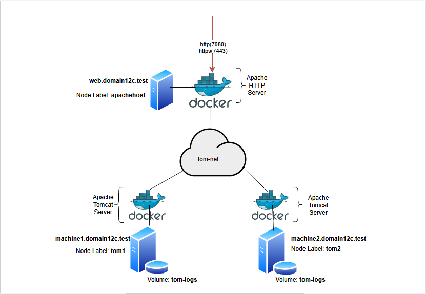

# apache-tomcat-docker-stack
A Docker Stack to create an Apache Tomcat container-based microservice.

## Overview
I have developed a Docker Stacks file, `apache-tomcat-docker-stack.yml`, to build a custom microservice comprising [Apache Tomcat](https://tomcat.apache.org/) instances front-ended by an [Apache HTTP web server](https://httpd.apache.org/) in a classic reverse-proxy configuration (see diagram below).




The configuration uses a custom encrypted *overlay* container network, called `tom-net`, so SSL is not needed for secure communications between the web server container and Tomcat server containers. Only the web server exposes its `Listen` ports externally, including an `https` port.

 
## Prerequisites
Before using the Stacks file to build the microservice the following is needed:

- [x] At least three host machines (preferably Linux) running a current version of Docker.

- [x] The host machines' have applicable hostname aliases assigned to them (either updated in their `/etc/hosts` files or using DNS) as shown in the diagram.  That is, `web.domain12c.test` for the machine intended to host the Apache HTTP web server and `machine1.domain12c.test` and `machine2.domain12c.test` for the machines intended host the Tomcat instances.

- [x] A user account on each host machine with the ability to run `docker` commands, (this may require `sudo`).

- [x] Custom Docker images for [Apache HTTP Server](https://github.com/rmyers3141/apache-http-docker-image-build) and [Apache Tomcat](https://github.com/rmyers3141/apache-tomcat-docker-image-build), and an accessible Docker repository to hold these images. (This is covered below).

- [x] Put the participating Docker node machines into *Swarm mode*, and any required *secrets* created in advance. (This is also covered below).


## Docker Image Creation
Docker Stacks doesn't support image creation, so the necessary Docker images must be prepared first.

The images used are created from the files in the following repositories:

- [apache-tomcat-docker-image-build](https://github.com/rmyers3141/apache-tomcat-docker-image-build)
- [apache-http-docker-image-build](https://github.com/rmyers3141/apache-http-docker-image-build)

However, instead of using the `config/*` files from these repos, use the following ones provided with this GitHub repo and contained in the folders:

- `apache-tomcat-config/`   - for [apache-tomcat-docker-image-build](https://github.com/rmyers3141/apache-tomcat-docker-image-build)
- `apache-http-config/`     - for [apache-http-docker-image-build](https://github.com/rmyers3141/apache-http-docker-image-build)

These files have some minor configuration changes to support the Swarm configuration.

Once the images have been prepared, save them to a suitable Docker image repository accessible from the host machines, and verify the are available, e.g.:

```sh
REPOSITORY          	      TAG       IMAGE ID       CREATED         SIZE
my_repo/apache-tomcat         v1      6221b51067b4   24 hours ago     506MB
my_repo/apache-http           v1      038eba9c555f   25 hours ago     145MB
```


## Prepare Docker node machines for Swarm mode
The Docker daemons participating in a Swarm need to be able to communicate with each other over the following ports, so you may need to check your machines' firewall ports to allow this traffic first:

- Port **2377 TCP** for Management communications.
- Port **7946 TCP/UDP** for container network discovery.
- Port **4789 UDP** for the overlay network (including ingress) data path.

In addition, this microservice requires TCP ports **7080** and **7443** open externally on the Apache HTTP web server node to support any application-specific HTTP/S traffic.

First, initialise a *Swarm* on one of the machine nodes with the command:

```sh
$ docker swarm init
```
This machine will become a *Manager* node.  Also, copy the files from this GitHub repo to a temporary directory on this machine.

Then copy the `docker swarm join....` command from the output of the above command to join the remaining nodes as *Worker* nodes to the Swarm, for example:

```sh
$ docker swarm join --token SWMTKN-1-abc...def 192.168.1.126:2377
```

The remaining commands can be done from the *Manager* node......

Once all nodes have been added to the Swarm, verify this with the command:

```sh
$ docker node ls
```

(Make sure the nodes' `AVAILABILITY` are listed as `Active`, which means they can receive workloads.)

Then, add the required labels to the nodes, depending on their particular role: -

For the node `web.domain12c.test` add the label:

```sh
$ docker node update --label-add apachehost=yes 
```

For the node `machine1.domain12c.test` add two labels:

```sh
$ docker node update –-label-add tomhost=yes
$ docker node update --label-add instance=tom1 
```

For the node `machine2.domain12c.test` add two labels:

```sh
$ docker node update –-label-add tomhost=yes
$ docker node update --label-add instance=tom2 
```

Finally, as this Stack configuration uses a *secret*, this must be created in advance.  Change to the directory where you have uploaded the file `TOMkeystore.p12` and run the command:

```sh
$ docker secret create tomcat_keystore ./TOMkeystore.p12
```

(NOTE: The custom Tomcat image created above uses a `server.xml` that references this secret with the line `<Certificate certificateKeystoreFile="/run/secrets/TOMkeystore.p12"`)

Verify the secret has been created with the command:

```sh
$ docker secret ls
```


## Deploy the Stack
Once all the above steps have been completed, the Stack can be deployed from the *Manager* node.

Changed to the directory on the Manager node where the file `apache-tomcat-docker-stack.yml` has been copied to and run the following command (inserting a preferred name for the Stack in `<STACK_NAME>`):

```sh
$ docker stack deploy –c apache-tomcat-docker-stack.yml <STACK_NAME>
```

### Checking the deployment
Once the Stack has been deployed, you can check it with a few standard `docker stack` commands, such as:

```sh
$ docker stack ls
$ docker stack ps <STACK_NAME>
$ docker stack services <STACK_NAME>
```

### Deleting the deployment
To remove the Stacks deployment, run the command:

```sh
$ docker stack rm <STACK_NAME>
```


## Background Notes

### Motivation
This is an exploratory development project to investigate the capabilities of Docker Swarm mode when deploying a classic multi-tiered web application as a microservice.


### Overview of the apache-tomcat-docker-stack.yml Stacks file:
The main sections of the Stacks file comprises:

```sh
services:
  # Specifies one Apache HTTP web server service (httpd) and two distinct Tomcat services (tom1, tom2)
volumes:
  # A volume for accessing the Tomcat logs in each Tomcat instance, called "tom-logs".
networks:
  # A custom encrypted overlay network, "tom-net".
secrets:
  # A single secret, "tomcat_keystore", corresponding to the SSL keystore used by the Tomcat instances.
```

### TO-DO:
This is a development and exploratory project that could benefit from many improvements.  For example:

- Many of the above preparation and execution steps could probably be automated with something like an Ansible playbook.

- Rather than have a distinct `service:` defined for each Tomcat instance, it would be better to have a single service covering all Tomcat instances.   However, this may require updating the Apache HTTP Server's reverse-proxy configuration appropriately.

- The custom Tomcat `server.xml` configuration file is configured to support the default Tomcat clustering mode, which uses **IP multicasting**.  However, it was found that **IP multicasting** is not currently supported when using an *overlay* network, so the Tomcat `server.xml` files will need to be adapted to support **TCP unicast**-based clustering instead.
